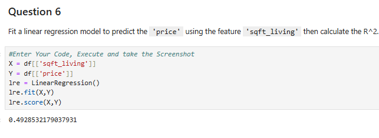

# Python for Data Analysis Final Project results
Lab: Results of each questions for IBM Python Data Analysis Final Project

## Question#1

## Question#2

## Question#3

## Question#4

## Question#5

## Question#6

## Question#7

## Question#8

## Question#9

## Question#10

